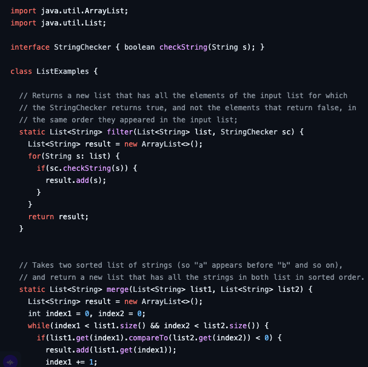
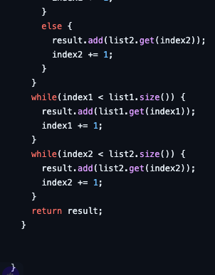
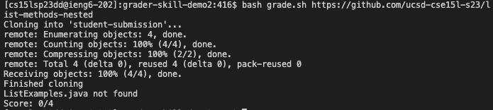
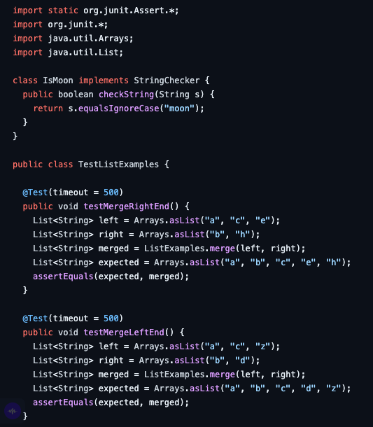
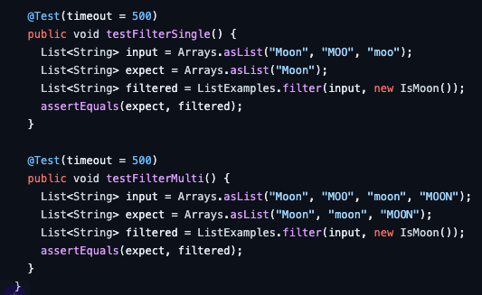
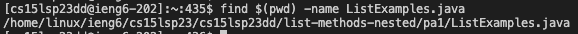
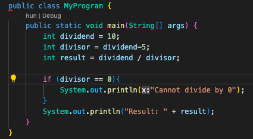
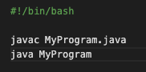
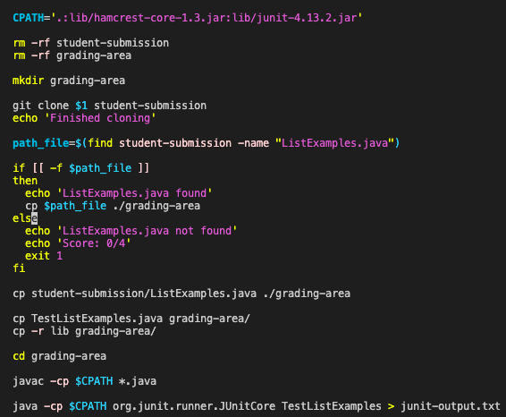

# Lab Report 5

## Part 1
1. Blog post:

- What environment are you using (computer, operating system, web browser, terminal/editor, and so on)?
macOS (operating system); VScode (editor); Chrome(browser) 


- Detail the symptom you're seeing. Be specific; include both what you're seeing and what you expected to see instead. Screenshots are great, copy-pasted terminal output is also great. Avoid saying “it doesn't work”.
I am trying to grade the student submissions in this repository (include link --> https://github.com/ucsd-cse15l-s23/list-methods-nested), but it is saying that ListExamples.java is not found. I am not sure what the problem is. This is a screenshot of the code that I have for ListExamples.java and the code I have for grad.sh.




```CPATH='.:lib/hamcrest-core-1.3.jar:lib/junit-4.13.2.jar'

rm -rf student-submission
rm -rf grading-area

mkdir grading-area

git clone $1 student-submission
echo 'Finished cloning'

if [[ -f student-submission/ListExamples.java ]]
then
  echo 'ListExamples.java found'
else
  echo 'ListExamples.java not found'
  echo 'Score: 0/4'
  exit 1
fi

cp student-submission/ListExamples.java ./grading-area

cp TestListExamples.java grading-area/
cp -r lib grading-area/

cd grading-area

javac -cp $CPATH *.java

java -cp $CPATH org.junit.runner.JUnitCore TestListExamples > junit-output.txt

# The strategy used here relies on the last few lines of JUnit output, which
# looks like:

# FAILURES!!!
# Tests run: 4,  Failures: 2

# We check for "FAILURES!!!" and then do a bit of parsing of the last line to
# get the count
FAILURES=`grep -c FAILURES!!! junit-output.txt`


if [[ $FAILURES -eq 0 ]]
then
  RESULT_LINE=`grep "OK " junit-output.txt`
  PASSED=${RESULT_LINE:4:1}
  TOTAL=$PASSED
else
  # The ${VAR:N:M} syntax gets a substring of length M starting at index N
  # Note that since this is a precise character count into the "Tests run:..."
  # string, we'd need to update it if, say, we had a double-digit number of
  # tests. But it's nice and simple for the purposes of this script.

  # See, for example:
  # https://stackoverflow.com/questions/16484972/how-to-extract-a-substring-in-bash
  # https://www.gnu.org/savannah-checkouts/gnu/bash/manual/bash.html#Shell-Parameter-Expansion

  RESULT_LINE=`grep "Tests run:" junit-output.txt`
  COUNT=${RESULT_LINE:25:1}
  TOTAL=${RESULT_LINE:11:1}

  PASSED=$(echo "($TOTAL-$COUNT)" | bc)

  echo "JUnit output was:"
  cat junit-output.txt
fi

echo ""
echo "--------------"
echo "| Score: $PASSED/$TOTAL |"
echo "--------------"
echo ""
```
This is the terminal output when I attempt to run the grading script.




- Detail the failure-inducing input and context. That might mean any or all of the command you're running, a test case, command-line arguments, working directory, even the last few commands you ran. Do your best to provide as much context as you can.

The command I am running to that is causing the bug is simply a bash command. The command is bash grade.sh https://github.com/ucsd-cse15l-s23/list-methods-nested. The command-line argument is grade.sh https://github.com/ucsd-cse15l-s23/list-methods-nested. The working directory is in grader-skill-demo2. The test cases are the following but the test cases are not what is impacting my code in this case because they are  not being run yet. 




The last command I ran was this (shown below).


2. TA response:
Based on the screenshots of your code that you have provided, I am not able to see what the problem is. Try doing running the ls command which shows the path to ListExamples.java. This is so that I can examine and identify bugs or unexpected behavior based on the file and directory structure. 

3. 


Based on that output, the problem with your code is that your code does not account for nested files. The if statement ```if [[ -f student-submission/ListExamples.java ]]``` only works if ListExamples.java is directly in student-submission. ListExamples.java is a nested file, so it is not being found by your code. You need to change the code in grade.sh to account for nested files (hint: you can do this using ```find```).

4. - The file & directory structure needed
The correct file and directory structure needed should be the following.


- The contents of each file before fixing the bug



- The full command line (or lines) you ran to trigger the bug


- A description of what to edit to fix the bug
Add ```path_file=$(find student-submission -name "ListExamples.java")``` in line 11. Change if statement in line 13 to ```if [[ -f $path_file ]]```, add ```cp $path_file ./grading-area``` to line 16. Finally, delete line 23.




## Part 2
Something I really cool that I learned in the second half of the quarter is that we could use vim to directly edit files in the terminal. I did not realize how powerful the terminal is and how much you could do from it. This is definitely something I will be using in the future.


