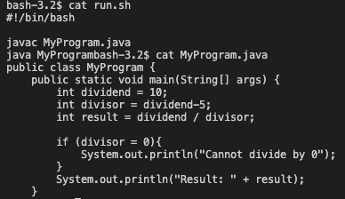

# Lab Report 5

## Part 1
1. Blog post:

- What environment are you using (computer, operating system, web browser, terminal/editor, and so on)?
macOS (operating system); VScode (editor); Chrome(browser) 


- Detail the symptom you're seeing. Be specific; include both what you're seeing and what you expected to see instead. Screenshots are great, copy-pasted terminal output is also great. Avoid saying “it doesn't work”.
I am trying to perform a simple math operation where I divide a number (dividend) by that same number with 5 subtracted from it. 


However, when I attempt to run my code I get this error message. I am not sure why this is happening because I am not trying to convert from an int to a boolean.


- Detail the failure-inducing input and context. That might mean any or all of the command you're running, a test case, command-line arguments, working directory, even the last few commands you ran. Do your best to provide as much context as you can.
I am simply doing the bash command. The command-line argument is run.sh. There are not test cases, because I change the value of the variables directly in the code. The working directory is the lab5 folder (as shown below). 


The last command I ran was this (shown below), but I accounted for that in my code.


2. TA response:
Based on the screenshots of your code that you have provided, I believe I can see where your mistake is. However, to confirm that this is the only problem, run the ```cat``` command on all your files in order for me to know that you have provided me with all the files accurately in your screenshots and so that I can examine and identify bugs or unexpected behavior. 

3. 


Based on that output, the bug is in line 7 of your code. When you are checking if one variable is equal to a value, you need to use the ```==``` operator, which is used for equality comparison. In your code, you write ```divisor = 0``` when you should write ```divisor == 0```. This is why the statement is being confused for a boolean statement.

4. - The file & directory structure needed
The correct file and directory structure needed should be the following.


- The contents of each file before fixing the bug


- The full command line (or lines) you ran to trigger the bug


- A description of what to edit to fix the bug
In line 7, ```divisor = 0``` needs to be changed to ```divisor == 0``` because in this case the ```==``` operator should be used not ```=```.


## Part 2
Something I really cool that I learned in the second half of the quarter is that we could use vim to directly edit files in the terminal. I did not realize how powerful the terminal is and how much you could do from it. This is definitely something I will be using in the future.


